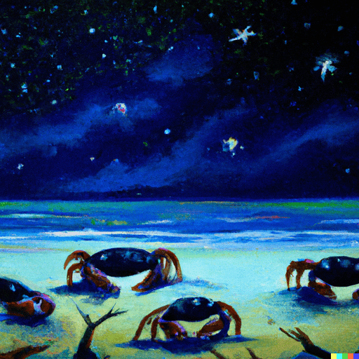

# Introduction

Embarking on a new adventure in the vast realm of web development, I find myself drawn to the unique and powerful language - Rust. This blog post series will document my experiences, challenges, and triumphs as I navigate the world of web development with Rust as my guide.

# The Genesis

Every journey has its beginning, and mine started with the curiosity to blend the robustness of Rust with the dynamic nature of web development. As I delve into this uncharted territory, I'll be sharing insights, code snippets, and lessons learned along the way.

# What to Expect

In this series, expect a blend of technical insights and personal reflections as I unravel the intricacies of Rust in the context of web development. From building simple web applications to exploring advanced concepts, join me on this exciting expedition.

# Tags and Categories

To make navigation easier, I've tagged each post with relevant keywords. Expect discussions on Rust, web development, and perhaps a few surprises along the way. Feel free to explore specific topics that pique your interest.

# Final words

As I set sail on this new journey, I invite you to accompany me. Whether you're a seasoned developer or someone just starting, let's learn and grow together in the fascinating world of web development with Rust.

Stay tuned for the first post in this series, coming soon!

